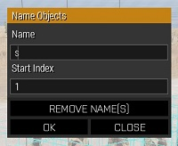
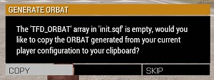
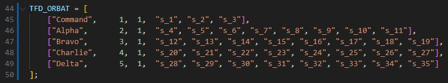

# Mission Framework

Welcome to the **TFD Mission Framework**! This repository contains the mission framework required for our regular Saturday night Arma missions, as well as other useful mission making tools such as compositions. 

See [CHANGELOG.md](CHANGELOG.md) for update history.

## Features
- Admin panel to allow fast player management outside of Zeus
- Includes [VCOM AI v3.4.0](https://github.com/genesis92x/VcomAI-3.0/tree/3.4.0-release) (disabled by default)
- Includes [JEBUS](https://github.com/DreadPirateAU/JEBUS) for easy editor based dynamic unit spawning and caching
- [Werthless Headless client](https://steamcommunity.com/sharedfiles/filedetails/?id=459317544) script for automated load balancing
- Includes a modified version of [DerZade's BackpackOnChest](https://github.com/DerZade/BackpackOnChest/tree/master) script
- Automatic ACRE radio programming and channel assignment based on squad configuration
- Easy and customisable mission intros, briefings and endings
- Templates to quickly add custom sounds and music to mission configuration
- Pre-made compositions including prefab objectives, player slots, FARPs and more to speed up mission design


## Support

For help with any contents of this README or the mission framework in general, join the [TFD Discord](https://discord.gg/cxx7qFuFbs) and ask for help in the `#mission-making` channel in the Arma category.


## Recommended tools

To make your life easier, it is highly recommended to install [Visual Studio Code](https://code.visualstudio.com) and the [SQF Language Updated](https://marketplace.visualstudio.com/items?itemName=blackfisch.sqf-language) and [SQFLint](https://marketplace.visualstudio.com/items?itemName=skacekachna.sqflint) extensions (requires [Java runtime](https://www.java.com/en/download/manual.jsp)).

This will give you nice syntax highlighting and error checking for the SQF script language, and it is also convenient for navigating between different script files as you can open your mission folder and navigate the entire file tree easily by right clicking on it in File Explorer and selecting `Open with Code`.


## Contents
- [Adding the framework to your mission file](#adding-the-framework-to-your-mission-file)
- [Importing the editor compositions](#importing-the-editor-compositions)
- [What do all these files do?](#what-do-all-these-files-do)
- [Usage](#usage)
  - [Setting up player slots](#setting-up-player-slots)
  - [Configuring `init.sqf`](#configuring-initsqf)
    - [Setting up the TFD ORBAT](#setting-up-the-tfd-orbat)
    - [Team colour assignment](#team-colour-assignment)
    - [Insignia/patch assignment](#insigniapatch-assignment)
    - [Radio assignment and programming](#radio-assignment-and-programming)
    - [Briefing and intro configuration](#briefing-and-intro-configuration)
    - [Equipment whitelist/blacklists](#equipment-whitelistblacklists)
    - [Spawn protection](#spawn-protection)
    - [Backpack on chest](#backpack-on-chest)
    - [Fuel consumption rates](#fuel-consumption-rates)
    - [Civilian casualty punishments](#civilian-casualty-punishments)
    - [Loadout randomisation](#loadout-randomisation)
  - [Configuring `description.ext`](#configuring-descriptionext)
    - [Adding custom mission endings](#adding-custom-mission-endings)
    - [Adding custom patches](#adding-custom-patches)
    - [Adding custom sounds](#adding-custom-sounds)
  - [Using JEBUS](#using-jebus)
  - [Using VCOM](#using-vcom)
  - [Admin panel features](#admin-panel-features)
  - [Scripts](#scripts)
    - [AI fire support](#ai-fire-support)
    - [AI stalk/follow](#ai-stalkfollow)
    - [Civilian randomisation](#civilian-randomisation)
    - [Garrison](#garrison)
    - [Dynamic markers](#dynamic-markers)
    - [Generate ORBAT](#generate-orbat)
    - [Get equipment classes](#get-equipment-classes)
    - [Generate supply box](#generate-supply-box)

---


## Adding the framework to your mission file
1. Download the latest version of the framework by selecting `Code > Download ZIP`.

1. Open your mission folder from the scenario editor by selecting `Scenario > Open Scenario Folder` or if you have **3den Enhanced** enabled, pressing `ALT + O`.
   > **WARNING**  
   > This folder contains your `mission.sqm`, it represents the mission file as loaded by the mission editor and the game. Be careful not to accidentally modify or delete this file as corrupting or removing it will erase everything you have built in the editor.
   
2. Copy the contents of the ZIP into your mission folder.

If done correctly, your mission folder should have files such as `init.sqf` and `description.ext` in the same directory as your missions's `mission.sqm` file:


> **NOTE**  
> You can delete the `!DELETE_ME` folder, `CHANGELOG.md` and `README.md` files to reduce the size of your mission as they are only used for GitHub/development.  
> 
> The `!TFD_Compositions` folder can also be deleted after you have followed the steps to [import the compositions](#importing-the-editor-compositions).


## Importing the editor compositions
1. Open your Arma 3 profile and navigate to the `compositions` folder. It should be located at:
   ```
   C:\Users\<YOUR_USER>\Documents\Arma 3 - Other Profiles\<YOUR_PROFILE>\compositions\
   ```
   > **NOTE**  
   > An easy way to get to this folder is to open your mission folder then go back up 2 levels, as your `missions` and `mpmissions` folders are also located in your profile.

2. Copy all the folders from inside the `!TFD_Compositions` folder into your `compositions` folder.
   > **IMPORTANT**  
   > If you have the mission editor open when you do this step, the compositions will not show up. Opening another mission file or closing the editor and reopening it should refresh the compositions list.

**You will have to repeat this process if the compositions are updated and you want to use the updated version.**


## What do all these files do?

> **IMPORTANT**  
> Much of the framework is already configured to work out of the box, however you should at the very least look at:
> - `description.ext` (Mission configuration file)
> - `init.sqf` (Initialisation script run on all clients)
> - `cba_settings.sqf` (CBA settings configuration)  
> 
> `init.sqf` is where most of the scripts are configured. See the comments (lines surrounded by `/* */` or preceeded by `//`) in these files for instructions on how to edit them.

| File/Folder | Purpose |
| --- | --- |
| `!DELETE_ME` | Used to store files that are useful to store in the framework (such as documentation) but are not a functional part of the framework and **can be deleted from the mission file to reduce the size.** |
| `!TFD_Compositions` | Contains editor compositions that can be imported into the editor. **Can be deleted from the mission file.** You only have to import these once, unless you wish to overwrite the compositions with an updated version. |
| `adminpanel` | Contains functionality and configuration for the TFD Admin Panel. **Add your STEAM64 ID to `ADMINLIST.hpp` to grant yourself access.** The default key to open the admin panel is `PAUSE BREAK` and this can be modified in your CBA settings while in-game. Also see [Admin panel features](#admin-panel-features). |
| `functions` | Contains functions added to the mission framework via the mission config's `CfgFunctions` class. **This is where the main functionality of the mission framework exists.** You can look through the functions in this folder to see what many of the scripts are doing. You can read more about [CfgFunctions on the BI Wiki](https://community.bistudio.com/wiki/Arma_3:_Functions_Library). |
| `jebus` | Contains the JEBUS script files. Usage instructions and ready to copy examples can be found in the [ReadMe.txt](jebus/ReadMe.txt) file. Also see [Using JEBUS](#using-jebus). |
| `media` | Contains files and configuration that allows usage of custom unit patches (via [CfgUnitInsignia](https://community.bistudio.com/wiki/Description.ext#CfgUnitInsignia)) and custom sounds (via [CfgSounds](https://community.bistudio.com/wiki/Description.ext#CfgSounds)). Instructions on how to add custom patches and sounds can be found in [patches.hpp](media/patches.hpp) and [sounds.hpp](media/sounds.hpp) respectively. Also see [Adding custom insignias](#adding-custom-insignias) and [Adding custom sounds](#adding-custom-sounds). |
| `scripts` | This folder is primarily for adding your own scripts to the mission. It also contains `playerSetup.sqf`, which is a script that is executed by the framework every time a player spawns so you can easily run scripts each time a player joins or respawns without using event handlers. |
| `vcom` | Contains the VCOM AI script files. Usage instructions and ready to copy examples can be found in the [README.txt](vcom/README.txt) file. Also see [Using VCOM](#using-vcom). |
| `cba_settings.sqf` | **This is where you can customise the missions's CBA settings.** Try to avoid drastically changing settings from their defaults to ensure a consistent experience. |
| `description.ext` | This is the [mission configuration file](https://community.bistudio.com/wiki/Description.ext), it allows you to customise many of your mission attributes as you would in the editor as well as add custom mission content to the game such as new insignias and sounds from the `media` folder. See [Adding custom mission endings](#adding-custom-mission-endings), [Adding custom insignias](#adding-custom-insignias) and [Adding custom sounds](#adding-custom-sounds). |
| `init.sqf` | This is one of many special [event scripts](https://community.bistudio.com/wiki/Event_Scripts) which are run automatically by the game. In this case, it is executed on each player, headless client and the server when the mission is first loaded. **This is the most important file in the framework as it contains the configuration for most of the scripts.**


## Usage

> **NOTE**   
> This usage section is only a guide to what the framework is capable of, you are not required to use all of these features. 

---


### Setting up player slots
<details>
  <summary>Click to expand</summary>
  <br>
There are a couple steps to set up player slots to work correctly with the mission framework:

1. Place player units. It is recommended to start with the command squad and a single rifle squad first. This allows the squad or loadouts to be copy pasted to easily create more squads. **The 'Platoon' compositions from the framework can be used to quickly perform this step if you want to use a standard squad configuration.**
    > **NOTE**  
    > Use vanilla units such as NATO, CSAT, AAF for player slots where possible. This ensures that there are no modded scripts interfering with the unit behaviour or loadout.
    > 
    > Using unit prefabs that match your intended role is also helpful to reduce setup time, e.g. using a NATO 'Combat Life Saver' as a medic role. This ensures that the units already have the relevant ACE skill types and makes it easier to identify different roles in the editor.

2. Set the commander role as the 'player' (red circle around icon), and all other roles as 'playable' (purple circle around icon). This ensures the mission is compatible with both singleplayer and multiplayer for easy testing.

3. Organise slots into the correct lobby order. This can be done using the Lobby Manager which can be opened with `CTRL + L` or `Tools > Lobby Manager`. There are several conventions that should be adhered to when ordering slots:
   - The command squad must be the first squad in the list.
   - The leader of each squad must be at the top of the squad.
   - (Optional) Support squads such as weapons teams/armour/aircraft should be ordered after any standard rifle squads.
   - (Optional) Any other roles inside a squad should be ordered in descending order of importance (e.g. Squad Leader > Medic > Team Leader, etc)

    > **IMPORTANT**  
    > If the first two conventions are not followed, scripts will still work but they may not interpret the commander and squad leader of each squad correctly.

4. Select all player slots, then press `ALT + N` or go to `Tools > Utilities > Name Objects` and set the 'Name' to `s` and 'Start Index' to `1`. 
    
    

    Assuming your lobby order is correct, this will assign each player slot a variable name starting with the commander as `s_1` and other slots beneath that following `s_2`, `s_3`, etc. This allows scripts to easily reference individual player slots.

Your player slots should now be configured correctly. **If you add or remove slots you may need to repeat the last two steps**. You will also need to generate a fresh TFD ORBAT, or you can manually edit the ORBAT to reflect your changes. See [Setting up the TFD ORBAT](#setting-up-the-tfd-orbat) for details.

</details>

---

### Configuring `init.sqf`

---

#### Setting up the TFD ORBAT

<details>
  <summary>Click to expand</summary>
  <br>

> **IMPORTANT**  
> If you have not already done so, you will need to set up your player slots before generating the TFD ORBAT. See [Setting up player slots](#setting-up-player-slots) for how to do this.

The TFD ORBAT variable in `init.sqf` is a major part of the configuration, as it contains the variable names of each player slot, their squad name and their radio channel assignment. This information is used in many scripts such as team colour, radio assignment and whitelist scripts to apply scripts to individual player slots or squads.

Once your player slots are set up correctly, play the scenario in singleplayer and you should be prompted automatically to copy the newly generated ORBAT:
    


If you do not receive a prompt to generate it, you may already have a different TFD ORBAT variable set. If so, you can generate an updated one by opening the debug console and executing `call TFD_fnc_generateORBAT`. This will automatically copy the new ORBAT to your clipboard.

Open your `init.sqf` file and find the line:
```sqf
TFD_ORBAT = [];
```

Select this line and paste the new ORBAT over the top of it using `CTRL + V`. The ORBAT should now look like this:


The first number in each row is the default short range radio channel for that squad. The second number is the default long range channel. Typically the command squad is assigned to short range channel 8, and other squads are assigned channels in ascending order from channel 1.

You may wish to assign specific units in a squad to a different channel to what is in the ORBAT (e.g. set FAC to LR channel 2 instead of 1). To do this, see [Assigning alternate default radio channel](#assigning-alternate-default-radio-channel).

To update the ORBAT if you have changed your slot configuration, you can do any of the following:
- Manually update the ORBAT (by adding slots, renaming squads, etc).
- Set the `TFD_ORBAT` variable back to `TFD_ORBAT = [];` and play in singleplayer. You will be prompted to generate the ORBAT again.
- Play in singleplayer and execute `call TFD_fnc_generateORBAT` from debug console.

</details>

---

#### Team colour assignment

<details>
  <summary>Click to expand</summary>
  <br>

Team colours can be pre-assigned to specific slots using the team assignment section of `init.sqf`. This should be located just below the TFD ORBAT. **The TFD ORBAT must be set up for this to work.** To assign a slot to a colour, simply place the name of that slot into the `TFD_RED_TEAM`, `TFD_BLUE_TEAM`, `TFD_YELLOW_TEAM` or `TFD_GREEN_TEAM` lists. e.g. to assign `s_1` and `s_2` to team red and `s_3` and `s_4` to team blue:

```sqf
TFD_RED_TEAM = ["s_1", "s_2"];
TFD_BLUE_TEAM = ["s_3", "s_4"];
TFD_YELLOW_TEAM = [];
TFD_GREEN_TEAM = [];
```

> **NOTE**
> An easy way to do this quickly is to select all the units you want to assign to a particular team in the editor, right click on one and select `Log > Log Variable Names to Clipboard`. You can then paste the result inside the square brackets.

</details>

---

#### Insignia/patch assignment

<details>
  <summary>Click to expand</summary>
  <br>

By default, the mission framework tries to assign an patch that matches the name of the squad that unit is in. This means that units in squad 'Alpha' will be assigned patch 'Alpha' if it exists, etc. If the unit has ACE medical skill, a medic patch that overwrites the squad patch will be assigned. This can be manually overwritten or disabled in the patch assignment section of `init.sqf` which should be just below the team assignment section.

- Set `ENABLE_PATCHES` to `false` to disable patch assignment. You will have to manually assign unit patches in the editor if you do this.
- Set `AUTOASSIGN_MEDIC_PATCH` to `false` to only assign squad patches.

To overwrite a slot's patch manually, add one or more rows to the `TFD_PATCH_ASSIGNMENT` array like so:

```sqf
TFD_PATCH_ASSIGNMENT = [
  [["s_1", "s_2"], "Command"],
  [["s_3", "s_4"], "Charlie"]
];
```

This will set slots `s_1` and `s_2` to have the 'Command' patch and `s_3` and `s_4` to have the 'Charlie' patch.

To add your own custom patches to the mission, see [Adding custom patches](#adding-custom-patches).

</details>

---

#### Radio assignment

<details>
  <summary>Click to expand</summary>
  <br>

Depending on your mission, you may wish to assign different types of radios to players or have a customised radio channel configuration. You can do this using the radio assignment and radio programming sections located beneath the patch assignment section of `init.sqf`.

> **IMPORTANT**  
> In order to avoid overfilling players inventories, radios are only added if there is space in the loadout. A message will be displayed to the player and printed to the log if their radio is not able to be added.  
> 
> **Ensure that there is enough space in the loadout for the radios you want to add.** Large radios such as the AN/PRC-117F may require a backpack.

- `TFD_CLEAR_RADIOS` is a broken setting and can be ignored. It will likely be removed in a future update.
- `TFD_AUTOASSIGN_RADIOS` can be set to `false` to disable automatic radio assignment. Loadouts will need to include radios if this is disabled, but **this is not recommended**.
- `TFD_USING_SR` can be set to `false` if playing a mission with only long range radios (like vietnam/WW2). This changes the message displayed in the mission start hint to say that there are no short range radios available.

The default configuration is to assign an AN/PRC-343 to everyone as a short range radio and an AN/PRC-152 to squad leaders as a long range:

```sqf
TFD_SRRADIOS = ["ACRE_PRC343", "ACRE_PRC148"];
TFD_LRRADIOS = ["ACRE_PRC152", "ACRE_SEM52SL", "ACRE_PRC117F"];

TFD_RADIO_ASSIGNMENT = [
    ["ACRE_PRC343", ["All"]],
    ["ACRE_PRC152", ["Leaders"]]
];
```

The radios that can be assigned are:
- `ACRE_PRC343` - Not programmed
- `ACRE_PRC148`
- `ACRE_PRC152`
- `ACRE_PRC117F`
- `ACRE_PRC77` - Not programmed
- `ACRE_SEM52SL`
- `ACRE_SEM70` - Not programmed

> **NOTE**  
> The AN/PRC-343 is not included in the programming script since it does not have a display so it makes no difference what the channels are programmed to. 
> 
> The AN/PRC-77 and SEM 70 radios are not included in the channel assignment/radio programming scripts as they do not have channels that can be assigned the same way as the other radios.

The assignment rules available are:
- `"GroupName"` - Assign this radio to each member of the group. e.g. `"Alpha"`
- `"varname"` - Assign this radio to a specific unit. e.g. `"s_3"`
- `"Leaders"` - Assign this radio to squad leaders.
- `"All"` - Assign this radio to everyone.

To add multiple rules for the same radio, add them to the rule array. e.g. To assign a AN/PRC-343 to all units, a AN/PRC-152 to squad leaders and a AN/PRC-117F to the commander (`s_1`) and FAC (`s_2`):

```sqf
TFD_RADIO_ASSIGNMENT = [
    ["ACRE_PRC343", ["All"]],
    ["ACRE_PRC152", ["Leaders"]],
    ["ACRE_PRC152", ["s_1", "s_2"]]
];
```

> **WARNING**  
> If a rule overlaps the same slot twice, the unit may be assigned duplicate radios. e.g. If using the configuration:
> ```sqf
> TFD_RADIO_ASSIGNMENT = [
>     ["ACRE_PRC343", ["All", "s_3"]]
> ];
> ```
> Slot `s_3` will be assigned two radios since it matches both the `"All"` and `"s_3"` rules.

To change if a radio is programmed as a short range or a long range, move it to the corresponding `TFD_SRRADIOS` or `TFD_LRRADIOS` array. e.g. To change the AN/PRC-152 to be programmed as a short range radio instead:

```sqf
TFD_SRRADIOS = ["ACRE_PRC343", "ACRE_PRC148", "ACRE_PRC152"];
TFD_LRRADIOS = ["ACRE_SEM52SL", "ACRE_PRC117F"];
```

</details>

---

#### Assigning alternate default radio channel

<details>
  <summary>Click to expand</summary>
  <br>

To assign specific units to radio channels separate from the TFD ORBAT configuration, you can use the `TFD_ALTERNATE_CHANNEL_ASSIGNMENT` array underneath the radio assignment section of `init.sqf`.

To do this, add one or more rows to the array like so:

```sqf
TFD_ALTERNATE_CHANNEL_ASSIGNMENT = [
    [["s_1", "s_2"], -1, 2],
    [["s_3", "s_4"], 3, -1]
];
```
Each row consists of the units whose channels you want to overwrite and the new short range and long range channel to assign. A value of `-1` will leave the channel as it was configured in the ORBAT.

The configuration from the example above will overwrite `s_1` and `s_2`'s default long range channel to be channel 2 but leave their short range channel unaffected, as well as changing `s_3` and `s_4`'s default short range channel to channel 3 while not affecting their long range channel.

</details>

---

#### Custom radio programming

<details>
  <summary>Click to expand</summary>
  <br>

If your radios have displays, you might want to configure custom labels or change which frequency the radios are programmed to. This can be done using the radio programming section of `init.sqf`, underneath the radio assignment section.

The channel labels for SR channels are left blank as by default they will be set to the name of the squad the channel is assigned to in the TFD ORBAT.

Setting `TFD_CUSTOM_SR_LABELS` to `true` will disable this behaviour and force the radio programming scripts to use the label from the `TFD_SR_CHANNELS` array.

The default configuration is:

```sqf
TFD_SR_CHANNELS = [
    [1, 311, ""],
    [2, 312, ""],
    [3, 313, ""],
    [4, 314, ""],
    [5, 315, ""],
    [6, 316, ""],
    [7, 317, ""],
    [8, 318, ""]
];

TFD_LR_CHANNELS = [
    [1, 50, "PLTNET 1"],
    [2, 51, "PLTNET 2"],
    [3, 52, "AIRNET"],
    [4, 53, "CAS"],
    [5, 54, "FIRES"],
    [6, 55, "AUX 1"],
    [7, 56, "AUX 2"]
];
```

The first item in each row is the channel number, the second is the frequency in MHz and the third is the channel label.

Different radios have different frequency ranges in ACRE (modelled based off the real radios). Radios without overlapping frequency ranges will not be able to communicate to each other.

| Radio | Frequency Range (MHz) |
| --- | --- |
| AN/PRC-343 | 2400 - 2483 | 
| AN/PRC-152 | 30 - 512 |
| AN/PRC-148 | 30 - 512 |
| AN/PRC-117F | 30 - 512 |
| AN/PRC-77 | 30 - 52.95 (Low band)<br>53 - 95.95 (High band) |
| SEM 52-SL | 46 - 65,975 |
| SEM 70 | 30 - 79,975 |

> **NOTE**  
> The AN/PRC-343 is not included in the programming script since it does not have a display so it makes no difference what the channels are programmed to. 
> 
> The AN/PRC-77 and SEM 70 radios are not included in the channel assignment/radio programming scripts as they do not have channels that can be assigned the same way as the other radios.

> **WARNING**  
> Attempting to program a radio to a channel outside it's frequency range will cause errors and may prevent the radio from functioning properly.

</details>

---

#### Briefing and intro configuration

---

#### Equipment whitelist/blacklists

---

#### Spawn protection

---

#### Backpack on chest

---

#### Fuel consumption rates

---

#### Civilian casualty punishments

---

#### Loadout randomisation

---

### Configuring `description.ext`

---

#### Adding custom mission endings

---

#### Adding custom patches

---

#### Adding custom sounds

---

### Using JEBUS

---

### Using VCOM

---

### Admin panel features

---

### Scripts

---

#### AI fire support

---

#### AI stalk/follow

---

#### Civilian randomisation

---

#### Garrison

---

#### Dynamic markers

---

#### Generate ORBAT

---

#### Get equipment classes

---

#### Generate supply box