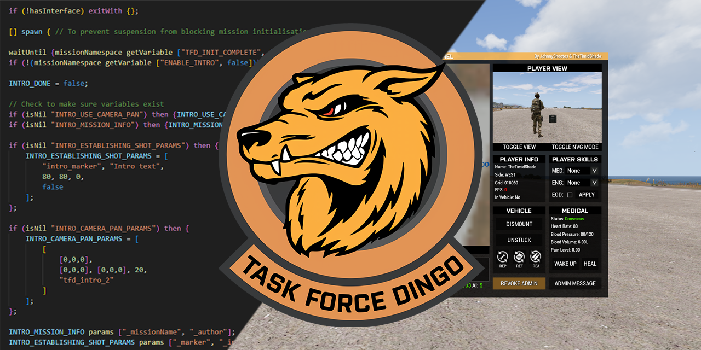
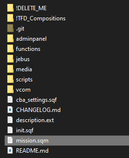

# Mission Framework

Welcome to the **TFD Mission Framework**! This repository contains the mission framework required for our regular Saturday night Arma missions, as well as other useful mission making tools such as compositions. 

See [CHANGELOG.md](CHANGELOG.md) for update history.

## Features
- Admin panel to allow fast player management outside of Zeus
- Includes [VCOM AI v3.4.0](https://github.com/genesis92x/VcomAI-3.0/tree/3.4.0-release) (disabled by default)
- Includes [JEBUS](https://github.com/DreadPirateAU/JEBUS) for easy editor based dynamic unit spawning and caching
- [Werthless Headless client](https://steamcommunity.com/sharedfiles/filedetails/?id=459317544) script for automated load balancing
- Includes a modified version of [DerZade's BackpackOnChest](https://github.com/DerZade/BackpackOnChest/tree/master) script
- Automatic ACRE radio programming and channel assignment based on squad configuration
- Easy and customisable mission intros, briefings and endings
- Templates to quickly add custom sounds and music to mission configuration
- Pre-made compositions including prefab objectives, player slots, FARPs and more to speed up mission design


## Support

For help with any contents of this README or the mission framework in general, join the [TFD Discord](https://discord.gg/cxx7qFuFbs) and ask for help in the `#mission-making` channel in the Arma category.


## Recommended tools

To make your life easier, it is highly recommended to install [Visual Studio Code](https://code.visualstudio.com) and the [SQF Language Updated](https://marketplace.visualstudio.com/items?itemName=blackfisch.sqf-language) and [SQFLint](https://marketplace.visualstudio.com/items?itemName=skacekachna.sqflint) extensions (requires [Java runtime](https://www.java.com/en/download/manual.jsp)).

This will give you nice syntax highlighting and error checking for the SQF script language, and it is also convenient for navigating between different script files as you can open your mission folder and navigate the entire file tree easily by right clicking on it in File Explorer and selecting `Open with Code`.


## Contents
- [Adding the framework to your mission file](#adding-the-framework-to-your-mission-file)
- [Importing the editor compositions](#importing-the-editor-compositions)
- [What do all these files do?](#what-do-all-these-files-do)
- [Usage](#usage)
  - [Configuring `init.sqf`](#configuring-initsqf)
    - [Setting up the TFD ORBAT](#setting-up-the-tfd-orbat)
    - [Team colour assignment](#team-colour-assignment)
    - [Insignia/patch assignment](#insigniapatch-assignment)
    - [Radio assignment and programming](#radio-assignment-and-programming)
    - [Briefing and intro configuration](#briefing-and-intro-configuration)
    - [Equipment whitelist/blacklists](#equipment-whitelistblacklists)
    - [Spawn protection](#spawn-protection)
    - [Backpack on chest](#backpack-on-chest)
    - [Fuel consumption rates](#fuel-consumption-rates)
    - [Civilian casualty punishments](#civilian-casualty-punishments)
    - [Loadout randomisation](#loadout-randomisation)
  - [Configuring `description.ext`](#configuring-descriptionext)
    - [Adding custom mission endings](#adding-custom-mission-endings)
    - [Adding custom insignias](#adding-custom-insignias)
    - [Adding custom sounds](#adding-custom-sounds)
  - [Using JEBUS](#using-jebus)
  - [Using VCOM](#using-vcom)
  - [Admin panel features](#admin-panel-features)
  - [Scripts](#scripts)
    - [AI fire support](#ai-fire-support)
    - [AI stalk/follow](#ai-stalkfollow)
    - [Civilian randomisation](#civilian-randomisation)
    - [Garrison](#garrison)
    - [Dynamic markers](#dynamic-markers)
    - [Generate ORBAT](#generate-orbat)
    - [Get equipment classes](#get-equipment-classes)
    - [Generate supply box](#generate-supply-box)

---


## Adding the framework to your mission file
1. Download the latest version of the framework by selecting `Code > Download ZIP`.

1. Open your mission folder from the scenario editor by selecting `Scenario > Open Scenario Folder` or if you have **3den Enhanced** enabled, pressing `ALT + O`.
   > **WARNING**  
   > This folder contains your `mission.sqm`, it represents the mission file as loaded by the mission editor and the game. Be careful not to accidentally modify or delete this file as corrupting or removing it will erase everything you have built in the editor.
   
2. Copy the contents of the ZIP into your mission folder.

If done correctly, your mission folder should have files such as `init.sqf` and `description.ext` in the same directory as your missions's `mission.sqm` file:



> **NOTE**  
> You can delete the `!DELETE_ME` folder, `CHANGELOG.md` and `README.md` files to reduce the size of your mission as they are only used for GitHub/development.  
> 
> The `!TFD_Compositions` folder can also be deleted after you have followed the steps to [import the compositions](#importing-the-editor-compositions).


## Importing the editor compositions
1. Open your Arma 3 profile and navigate to the `compositions` folder. It should be located at:
   ```
   C:\Users\<YOUR_USER>\Documents\Arma 3 - Other Profiles\<YOUR_PROFILE>\compositions\
   ```
   > **NOTE**  
   > An easy way to get to this folder is to open your mission folder then go back up 2 levels, as your `missions` and `mpmissions` folders are also located in your profile.

2. Copy all the folders from inside the `!TFD_Compositions` folder into your `compositions` folder.
   > **IMPORTANT**  
   > If you have the mission editor open when you do this step, the compositions will not show up. Opening another mission file or closing the editor and reopening it should refresh the compositions list.

**You will have to repeat this process if the compositions are updated and you want to use the updated version.**


## What do all these files do?

> **IMPORTANT**  
> Much of the framework is already configured to work out of the box, however you should at the very least look at:
> - `description.ext` (Mission configuration file)
> - `init.sqf` (Initialisation script run on all clients)
> - `cba_settings.sqf` (CBA settings configuration)  
> 
> `init.sqf` is where most of the scripts are configured. See the comments (lines surrounded by `/* */` or preceeded by `//`) in these files for instructions on how to edit them.

| File/Folder | Purpose |
| --- | --- |
| `!DELETE_ME` | Used to store files that are useful to store in the framework (such as documentation) but are not a functional part of the framework and **can be deleted from the mission file to reduce the size.** |
| `!TFD_Compositions` | Contains editor compositions that can be imported into the editor. **Can be deleted from the mission file.** You only have to import these once, unless you wish to overwrite the compositions with an updated version. |
| `adminpanel` | Contains functionality and configuration for the TFD Admin Panel. **Add your STEAM64 ID to `ADMINLIST.hpp` to grant yourself access.** The default key to open the admin panel is `PAUSE BREAK` and this can be modified in your CBA settings while in-game. Also see [Admin panel features](#admin-panel-features). |
| `functions` | Contains functions added to the mission framework via the mission config's `CfgFunctions` class. **This is where the main functionality of the mission framework exists.** You can look through the functions in this folder to see what many of the scripts are doing. You can read more about [CfgFunctions on the BI Wiki](https://community.bistudio.com/wiki/Arma_3:_Functions_Library). |
| `jebus` | Contains the JEBUS script files. Usage instructions and ready to copy examples can be found in the [ReadMe.txt](jebus/ReadMe.txt) file. Also see [Using JEBUS](#using-jebus). |
| `media` | Contains files and configuration that allows usage of custom unit patches (via [CfgUnitInsignia](https://community.bistudio.com/wiki/Description.ext#CfgUnitInsignia)) and custom sounds (via [CfgSounds](https://community.bistudio.com/wiki/Description.ext#CfgSounds)). Instructions on how to add custom patches and sounds can be found in [patches.hpp](media/patches.hpp) and [sounds.hpp](media/sounds.hpp) respectively. Also see [Adding custom insignias](#adding-custom-insignias) and [Adding custom sounds](#adding-custom-sounds). |
| `scripts` | This folder is primarily for adding your own scripts to the mission. It also contains `playerSetup.sqf`, which is a script that is executed by the framework every time a player spawns so you can easily run scripts each time a player joins or respawns without using event handlers. |
| `vcom` | Contains the VCOM AI script files. Usage instructions and ready to copy examples can be found in the [README.txt](vcom/README.txt) file. Also see [Using VCOM](#using-vcom). |
| `cba_settings.sqf` | **This is where you can customise the missions's CBA settings.** Try to avoid drastically changing settings from their defaults to ensure a consistent experience. |
| `description.ext` | This is the [mission configuration file](https://community.bistudio.com/wiki/Description.ext), it allows you to customise many of your mission attributes as you would in the editor as well as add custom mission content to the game such as new insignias and sounds from the `media` folder. See [Adding custom mission endings](#adding-custom-mission-endings), [Adding custom insignias](#adding-custom-insignias) and [Adding custom sounds](#adding-custom-sounds). |
| `init.sqf` | This is one of many special [event scripts](https://community.bistudio.com/wiki/Event_Scripts) which are run automatically by the game. In this case, it is executed on each player, headless client and the server when the mission is first loaded. **This is the most important file in the framework as it contains the configuration for most of the scripts.**


## Usage

> **NOTE**  
> Under construction :) 

---

### Configuring `init.sqf`

#### Setting up the TFD ORBAT

#### Team colour assignment

#### Insignia/patch assignment

#### Radio assignment and programming

#### Briefing and intro configuration

#### Equipment whitelist/blacklists

#### Spawn protection

#### Backpack on chest

#### Fuel consumption rates

#### Civilian casualty punishments

#### Loadout randomisation

---

### Configuring `description.ext`

#### Adding custom mission endings

#### Adding custom insignias

#### Adding custom sounds

---

### Using JEBUS

---

### Using VCOM

---

### Admin panel features

---

### Scripts

#### AI fire support

#### AI stalk/follow

#### Civilian randomisation

#### Garrison

#### Dynamic markers

#### Generate ORBAT

#### Get equipment classes

#### Generate supply box