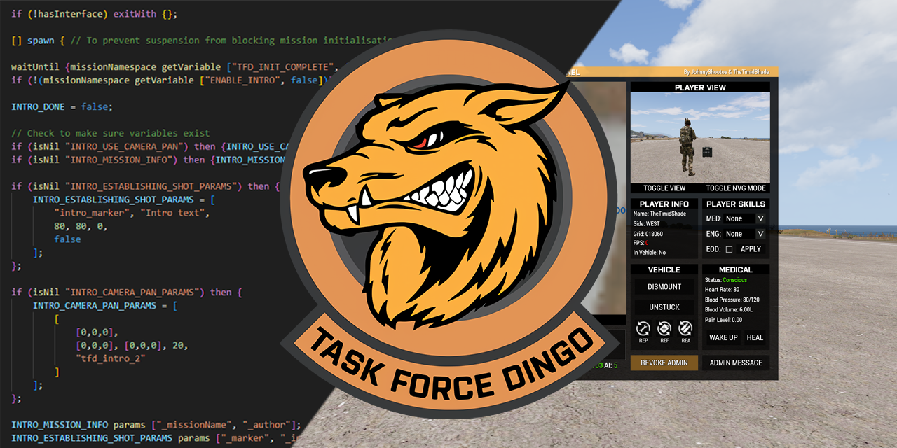
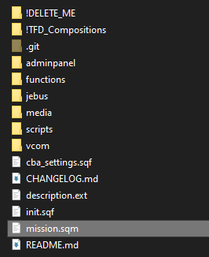

# Mission Framework

Welcome to the **TFD Mission Framework**! This repository contains the mission framework required for our regular Saturday night Arma missions, as well as other useful mission making tools such as compositions. 

See [CHANGELOG.md](CHANGELOG.md) for update history.

## Features
- Admin panel to allow fast player management outside of Zeus
- Includes [VCOM AI v3.4.0](https://github.com/genesis92x/VcomAI-3.0/tree/3.4.0-release) (disabled by default)
- Includes [JEBUS](https://github.com/DreadPirateAU/JEBUS) for easy editor based dynamic unit spawning and caching
- [Werthless Headless client](https://steamcommunity.com/sharedfiles/filedetails/?id=459317544) script for automated load balancing
- Includes a modified version of [DerZade's BackpackOnChest](https://github.com/DerZade/BackpackOnChest/tree/master) script
- Automatic ACRE radio programming and channel assignment based on squad configuration
- Easy and customisable mission intros, briefings and endings
- Templates to quickly add custom sounds and music to mission configuration
- Pre-made compositions including prefab objectives, player slots, FARPs and more to speed up mission design

## Contents
- [Adding the framework to your mission file](#adding-the-framework-to-your-mission-file)
- [Importing the editor compositions](#importing-the-editor-compositions)

---

## Adding the framework to your mission file
1. Download the latest version of the framework by selecting `Code > Download ZIP`.

1. Open your mission folder from the scenario editor by selecting `Scenario > Open Scenario Folder` or if you have **3den Enhanced** enabled, pressing `ALT + O`.
   
1. Copy the contents of the ZIP into your mission folder.

If done correctly, your mission folder should have files such as `init.sqf` and `description.ext` in the same directory as your missions's `mission.sqm` file:



> **NOTE**  
> You can delete the `!DELETE_ME` folder, `CHANGELOG.md` and `README.md` files to reduce the size of your mission as they are only used for GitHub/development.  
> 
> The `!TFD_Compositions` folder can also be deleted after you have followed the steps to [import the compositions](#importing-the-editor-compositions).

> **WARNING**  
> Be careful not to accidentally modify or delete your `mission.sqm`, it represents the mission file as loaded by the mission editor and the game. Corrupting or removing it will erase everything you have built in the editor.

---

## Importing the editor compositions
1. Open your Arma 3 profile and navigate to the `compositions` folder. It should be located at:
   ```
   C:\Users\<YOUR_USER>\Documents\Arma 3 - Other Profiles\<YOUR_PROFILE>\compositions\
   ```
   > **NOTE**  
   > An easy way to get to this folder is to open your mission folder then go back up 2 levels, as your `missions` and `mpmissions` folders are also located in your profile.

2. Copy all the folders from inside the `!TFD_Compositions` folder into your `compositions` folder.
   > **IMPORTANT**  
   > If you have the mission editor open when you do this step, the compositions will not show up. Opening another mission file or closing the editor and reopening it should refresh the compositions list.